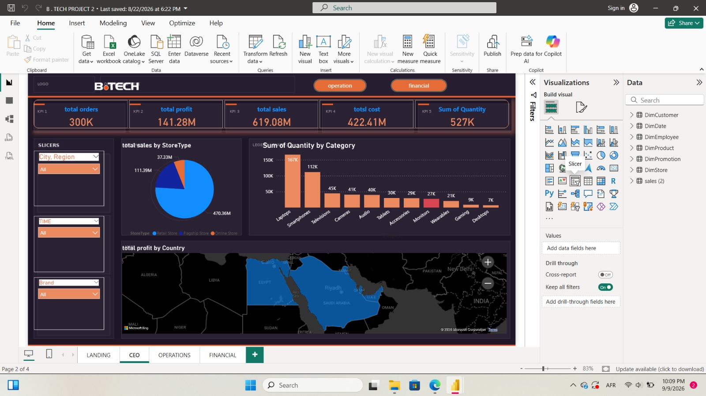
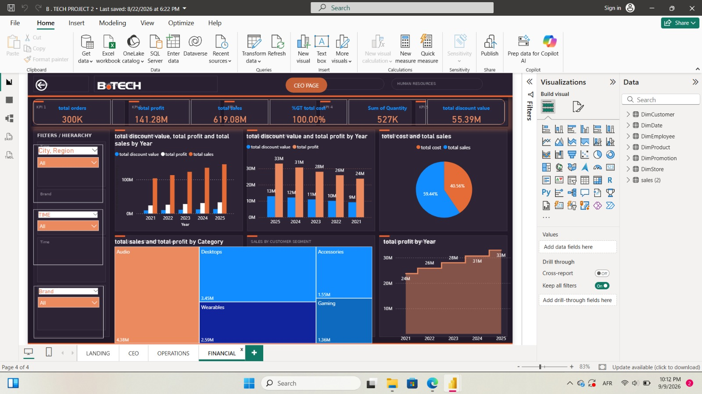
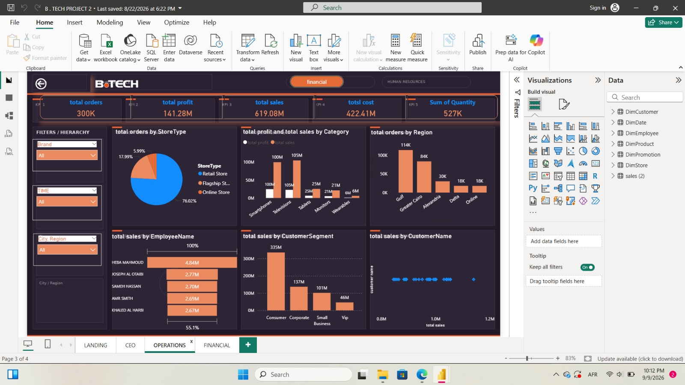

# Data Analysis Portfolio
# Sarah Abdelgilil

Welcome to my Data Analysis Portfolio.

Here, you can explore my projects in data visualization, business analysis, and data-driven insights.

---

### Projects

#### 1. Sales & Business Performance Dashboard – Power BI

An interactive Power BI dashboard designed to analyze business performance from different perspectives.

---

This page provides a high-level overview of business performance to support executive decision-making.

**Key Insights**
* Sales by Store Type
* Sum of Quantity by Store Type
* Sales by Region
* Product Performance
* Customer Analysis
* Overall Business KPIs

---

## FINANCIAL PAGE

This page focuses on the financial performance of the business and provides insights into revenue, sales, discounts, and profitability.

**Key Insights**
* Total Revenue
* Sales Performance
* Revenue by Product Category
* Revenue by Store Type
* Discount Analysis
* Financial KPIs

---

## OPERATIONS PAGE

This page focuses on operational performance and helps identify trends across stores, products, regions, and sales activities.

This page provides a high-level overview of business performance to support executive decision-making.

**Key Insights**
* Sales by Store Type
* Sum of Quantity by Store Type
* Sales by Region
* Product Performance
* Customer Analysis
* Overall Business KPIs

---

## FINANCIAL PAGE

This page focuses on the financial performance of the business and provides insights into revenue, sales, discounts, and profitability.

**Key Insights**
* Total Revenue
* Sales Performance
* Revenue by Product Category
* Revenue by Store Type
* Discount Analysis
* Financial KPIs

---

## OPERATIONS PAGE

This page focuses on operational performance and helps identify trends across stores, products, regions, and sales activities.
